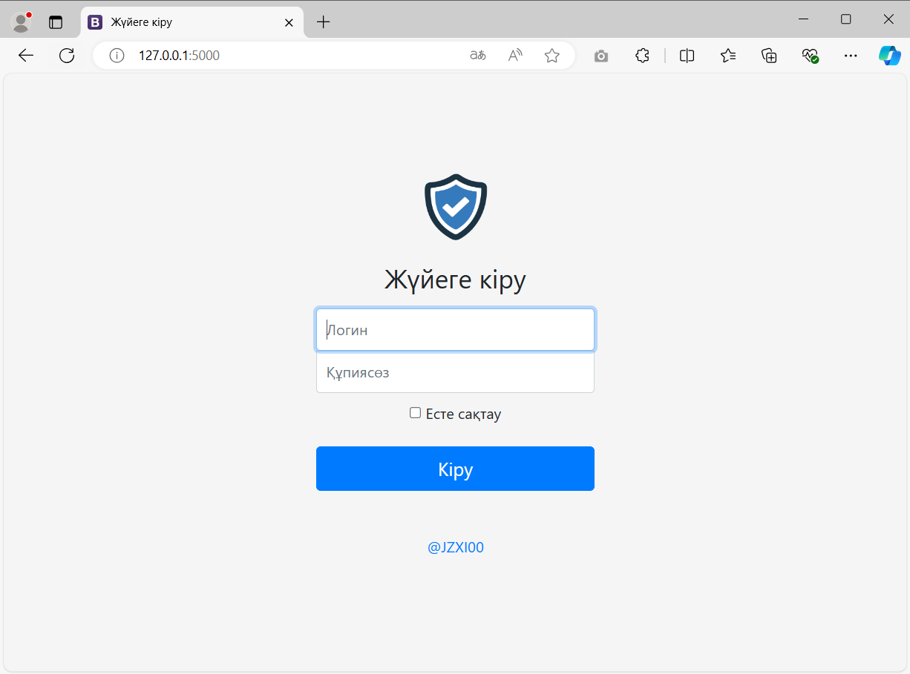
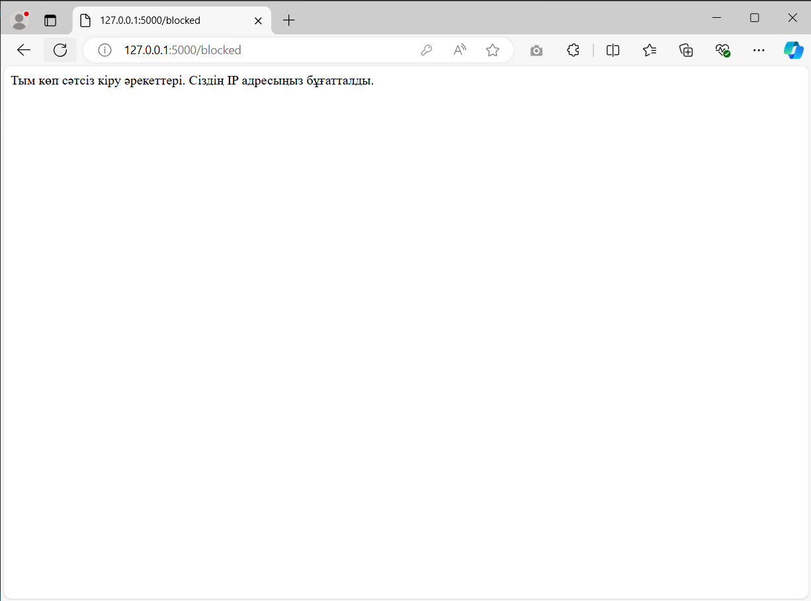

# Логин кезіндегі әртүрлі шабуылдарды бұғаттаудың мысал коды
Бұл Python тілінде Flask фреймворкын қолданып жазылған веб-қосымша логин кезінде шабуылдарды болдырмаудың жай ғана мысалы. Бұл қосымша SQL инъекциясы, XXS шабуылдары және күдікті әрекеттер сияқты шабуылдарды анықтау үшін арналған. Қосымша жай ғана логин парақшасы мен пайдаланушы енгізген деректерді күдікті әрекеттердің белгілері бойынша тексеретін ең қарапайым backend-ті көрсетеді. <b>Бұл қосымша ешқандай шабуылдан қорғамайды және логиннен кейін ешқайда бағыттамайды.</b> Қосымшада шабуылдарды тексеретін 4 функция ұсынылған, және үш рет қате әрекеттен кейін IP адресі бұғатталды.

* Қолданылған тіл: <b>Python 3.7.5</b> 
* Фрейворк: <b>Flask</b>

<b>app.py</b> файлында бағдарламаның коды орналасқан.<br>
<b>templates</b> папкасында логин парақшасының коды орналасқан.
## Скриншоттар




Осы 3 функция енгізілген дерекерді тексереді
```
def detect_xss(input_value):
	xss_patterns = [
		r"<script.*?>.*?</script>",
		r"<.*?on\w+.*?>",
	]
	for pattern in xss_patterns:
		if re.search(pattern, input_value, re.IGNORECASE):
			return True

	return False


def detect_sql_injection(input_value):
	sql_injection_patterns = [
		r"(\b(SELECT|UNION|INSERT|UPDATE|DELETE|DROP|CREATE|ALTER)\b)",
		r"('\s*OR\s+'[0-9a-zA-Z_-]+?\s*=\s*[0-9a-zA-Z_-]+?\s*')",
	]

	for pattern in sql_injection_patterns:
		if re.search(pattern, input_value, re.IGNORECASE):
			return True

	return False


def detect_suspicious_request(input_value):
	suspicious_pattern = r"(\w)\1{3,}"

	if re.search(suspicious_pattern, input_value, re.IGNORECASE):
		return True

	return False
```
Күдікті сұраныстардың мысалдары:
```
XSS (Cross-Site Scripting):

    "<script>alert('XSS')</script>"
    ""
    "<div onmouseover="alert('XSS')">Hover over me!</div>"

SQL инъекция:
    "SELECT * FROM users WHERE username = 'admin' OR '1'='1'"
    "UNION SELECT password FROM users"
    "DROP TABLE users;"

Күдікті сұраныс:
    "aaaaBBBB"
    "!!!alert!!!"
    "testinggggg123"
```

## Орнату
> GitHub-қа тіркеліп осы жобадағы <b>⭐Star</b> тетігін басыңыз (қалауыңызбен)

[Python](https://www.python.org/) веб-сайтынан Python бағдарламасын орнатыңыз (бұл жүйеге ең қолайлы - 3.7.5 версиясы).

Озіңізге ұнайтын Python бағдарламалау ортасын орнатыңыз, мысалға [Pycharm](https://www.jetbrains.com/ru-ru/pycharm/).

Жобаны жүктеп алып, архивтен шығарып оны кез келген ыңғайлы жерге орналастырыңыз. 

Сосын <b>Командная строка</b>-ны ашып мына командаларды енгізіңіз (жобаның орынын озіңіздін жобаны орналастырған жерімен ауыстырыңыз)

```
cd C:\Users\JZX100\Projects\login-page-guard-sample_kz-main
python -m venv env
env\Scripts\activate
pip install Flask
```
Қолданбаны қосу үшін:
```
flask run
```

Жүйеге кіру үшін дұрыс деректер:
```
admin
password
```

## Байланыс
* Егер сізде осы жоба жайлы сұрақтар туындаса <b>Issues</b> парақшасында сұраныс қалдырсаңыз болады. 
* Менімен осы сілтеме бойынша Telegram желісінде байланысуға болады - [@JZX_I00](https://t.me/JZX_I00). 
